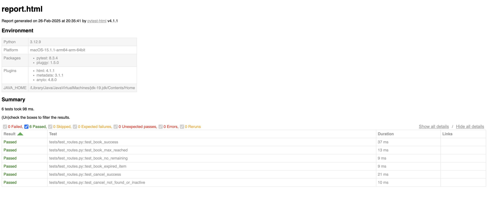

# Booking & Cancellation System API

This project is a FastAPI-based booking system that allows members to book inventory items. It includes functionalities for booking, canceling bookings, and uploading members and inventory data via CSV files.

## Table of Contents

- [Installation](#installation)
- [Environment Variables](#environment-variables)
- [Running the Application](#running-the-application)
- [Sample Data](#sample-data)
- [API Routes](#api-routes)
- [Upload CSV via FastAPI App Docs](#upload-csv-via-fastapi-web-docs)
- [CSV Upload via CLI](#csv-upload-via-cli)
- [Testing](#testing)

## Installation

1. Clone the repository:
    ```sh
    git clone https://github.com/your-repo/amit-singh-ten-lifestyle-asignment.git
    cd amit-singh-ten-lifestyle-asignment
    ```

2. Create a virtual environment and activate it:
    ```sh
    python3 -m venv venv
    source venv/bin/activate  # On Windows use `venv\Scripts\activate`
    ```

3. Install the required dependencies:
    ```sh
    pip install -r requirements.txt
    ```

## Environment Variables

Create a `.env` file in the root directory and add the following environment variables:

```
DB_HOST=your_db_host
DB_NAME=your_db_name
DB_USER=your_db_user
DB_PASS=your_db_password
DB_PORT=your_db_port
API_KEY=your_api_key
```

## Running the Application

1. Start the FastAPI application:
    ```sh
    uvicorn app.main:app --host 0.0.0.0 --port 8000 --reload
    ```

2. The application will be available at `http://localhost:8000`.

## Sample Data

A Sample data file for Members and Inventory has also been added for convenience if you play around with that.

Checkout the `sample_data` module.

## API Routes

### Book Route Design

- **Create Booking**
    - **Endpoint:** `POST /api/book`
    - **Description:** Create a new booking.
    - **Headers:** `x-api-key: your_api_key`
    - **Request Body:**
        ```json
        {
            "member_id": 1,
            "inventory_id": 1
        }
        ```
    - **Response:**
        ```json
        {
            "id": 1,
            "member_id": 1,
            "inventory_id": 1,
            "is_active": true,
            "booking_reference": "uuid",
            "booking_datetime": "2024-01-01T10:00:00"
        }
        ```

### Cancel Route Design
- **Cancel Booking**
    - **Endpoint:** `POST /api/cancel`
    - **Description:** Cancel an existing booking.
    - **Headers:** `x-api-key: your_api_key`
    - **Query Params:** `booking_reference=uuid`
    - **Response:**
        ```json
        {
            "id": 1,
            "member_id": 1,
            "inventory_id": 1,
            "is_active": false,
            "booking_reference": "uuid",
            "booking_datetime": "2024-01-01T10:00:00"
        }
        ```

### Upload Route Design 

- **Upload Members CSV**
    - **Endpoint:** `POST /api/members`
    - **Description:** Upload a CSV file of members.
    - **Headers:** `x-api-key: your_api_key`
    - **Form Data:** `file: members.csv`
    - **Response:**
        ```json
        {
            "message": "Uploaded X members."
        }
        ```

- **Upload Inventory CSV**
    - **Endpoint:** `POST /api/inventory`
    - **Description:** Upload a CSV file of inventory items.
    - **Headers:** `x-api-key: your_api_key`
    - **Form Data:** `file: inventory.csv`
    - **Response:**
        ```json
        {
            "message": "Uploaded X inventory items."
        }
        ```

## Upload CSV via FastAPI Web Docs
- **Go to `http://localhost:8000/docs`**
    - Find the Upload Routes section
    - Choose the upload route you'd like to try (`/inventory` or `/members`)
    - Input the API Secret Key
    - Upload the respective file

## CSV Upload via CLI

1. You can also upload CSV files via the CLI:
    ```sh
    python main.py --upload-file path/to/your/csvfile.csv
    ```

2. The script will automatically detect whether the CSV file is for members or inventory based on the column headers.


## Testing

1. To run the tests, use the following command:
    ```sh
    pytest
    ```
    or for a more verbose experience:
    ```sh
    pytest pytest --maxfail=1 --disable-warnings -v
    ```

2. The tests are located in the `tests` directory and cover various scenarios for booking and canceling functionalities.

**OR**

- Instead of running the if you want to chekout the test report generated by me,
check out the `report/report.html` for the test report.


